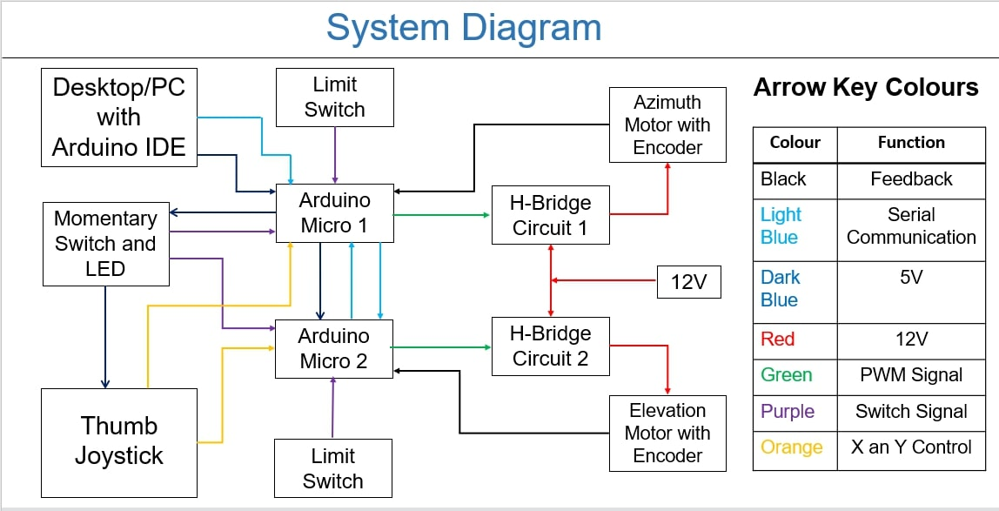

# **Electro-Optical System (EOS)**

## About The Project

The project is about the design and built of a EOS prototype that use the following components:

1. Arduino Micros
2. DC Brushed Motor with quadrature encoders
3. Limit switches
4. Darlington pair transistors (NPN and PNP)
5. BJT's
6. Momentary switch
7. Thumb Joystick

The system is controlled using the serial command of the Arduino IDE or the thumb joystick, this is obtained by using a momentary switch with an LED to show the mode of command that is used. The Arduino micro uses these commands as PWM percentages and drive 4 darlington pair transistors configured in a H-Bridge configuration to drive the motor clockwise and anti-clockwise direction.The prototype responds according to the commands given by either the Joystick or the Serial monitor of the Arduino IDE. This process is loaded to 2 Arduino micros communicating via the serial port Tx and Rx.

## How the project Works

The prototype uses 2 dc brushed motors with quadrature encoders, 2 H-bridge circuits, limit switches, a thumb joystick, a power switch and 2 Arduino micros. The casing of the prototype had to be 3D printed to specifications in order for the whole system to work.

One of the Arduino micros contains a primary code and the other one contains a secondary code, they communicate with each other via the serial interface port. On power up the Arduino send a constant PWM pulse to the H-bridge circuit to allow a 50% voltage margin to pass through and rotate the motors clockwise, the motor rotate until a limit switch is activated indicating end point and send a signal to the Arduino to change the direction of rotation to anti-clockwise. This happens so that the Arduino can count the number of steps of the encoder and map them to degrees of the azimuth and elevation direction needed. After the Arduino has mapped the values, the system is set at the 0 direction point waiting for a command. The commands are sent via the serial monitor of the Arduino IDE or by the use of the thumb joystick. The selection of which interface to use when sending commands to the system is done by using a 1 way switch with an indicator LED that turns on or off showing if the user has selected to use the serial monitor or thumb joystick. The commands sent to the Arduino are the ones that control the direction of azimuth and elevation.
